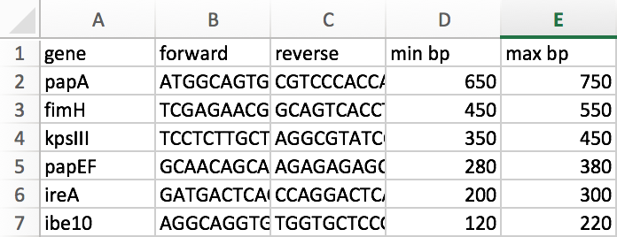

# RoDTIS: Robust DNA Targeting *in silico*
#### A script that returns the gene sequences of interest in an electronic PCR-like manner. 
This script was used in Nielsen *et al.* (2018). Working title: Association of Outer Membrane Protein A.

<br>

## Assumptions

 * [Python 3](https://www.anaconda.com/download/#macos) is installed on machine.
 * [Biopython](https://biopython.org/wiki/Download) is installed on machine. 
 * User has bash terminal. 
 * The title of sequences are presumed to be in an NCBI-like format, as the output will be named `[gene]_AATDWI010000001.1`  (e.g.: >AATDWI010000001.1 Escherichia coli strain 197080 SAMN05750861-rid6247213.denovo.001, whole genome shotgun sequence). Without a space, the sequences may be interpreted as sequence names.

<br>

## Input
##### Standard: 
1. Create an Excel sheet with the gene name, primers, and size range of product as follows:
E.g.: 

2. ```RoDTIS.py Panel1.xlsx fasta_files/* > Output.fasta```


##### Advanced: 
RoDTIS allows for variable matching of the last half of the primer used, which sets it apart for simply matching the primer in the sequence. 

 * To use the advanced option, use the ```-s``` flag. 
 	* The ```-s``` flag must be used with an interval between 0.0-1.0.
 		* The higher the number:
 		* The lower the number: 
 	* e. g. ```RoDTIS.py -s 0.2 Panel1.xlsx fasta_files/* > Output.fasta```

<br>

## Output
Open FASTA file in the program of your choice, and view the genes within each fasta file.


<br>
